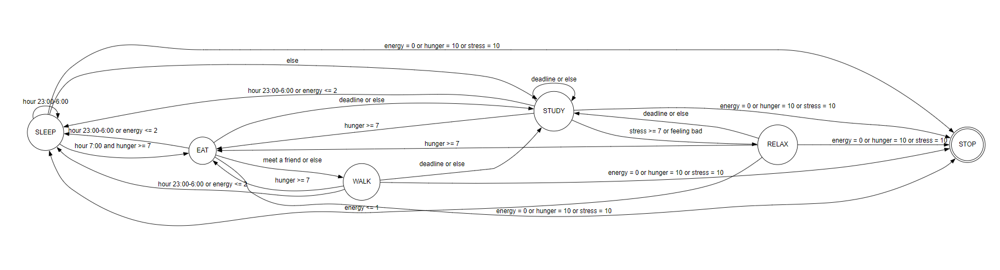
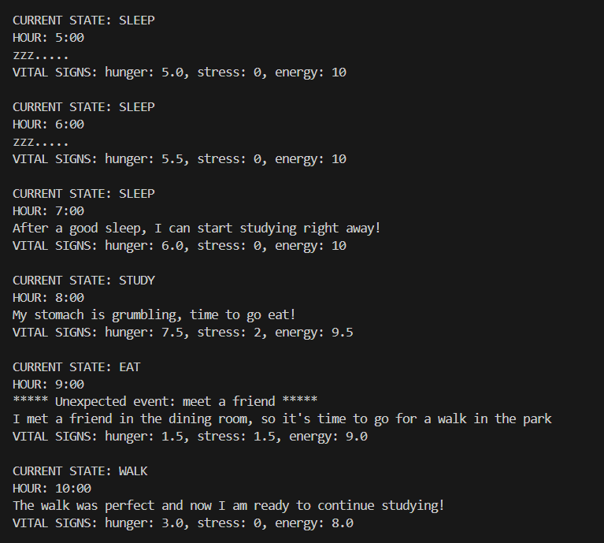

# simulation

Це симуляція одного дня з життя студента з використанням скінченного автомату,
діаграма якого зображена нижче:

Посилання на діаграму: http://magjac.com/graphviz-visual-editor/?dot=digraph%20finite_state_machine%20%7B%0A%09fontname%3D%22Helvetica%2CArial%2Csans-serif%22%0A%09node%20%5Bfontname%3D%22Helvetica%2CArial%2Csans-serif%22%5D%0A%09edge%20%5Bfontname%3D%22Helvetica%2CArial%2Csans-serif%22%5D%0A%09rankdir%3DLR%3B%0A%09node%20%5Bshape%20%3D%20doublecircle%5D%3B%20DEAD%3B%0A%09node%20%5Bshape%20%3D%20circle%5D%3B%0A%09SLEEP%20-%3E%20EAT%20%5Blabel%20%3D%20%22hour%207%3A00%20and%20hunger%20%3E%3D%207%22%5D%3B%0A%09SLEEP%20-%3E%20STUDY%20%5Blabel%20%3D%20%22else%22%5D%3B%0A%09SLEEP%20-%3E%20SLEEP%20%5Blabel%20%3D%20%22hour%2023%3A00-6%3A00%22%5D%0A%09EAT%20-%3E%20SLEEP%20%5Blabel%20%3D%20%22hour%2023%3A00-6%3A00%20or%20energy%20%3C%3D%202%22%5D%0A%09EAT%20-%3E%20WALK%20%5Blabel%20%3D%20%22meet%20a%20friend%20or%20else%22%5D%0A%09EAT%20-%3E%20STUDY%20%5Blabel%20%3D%20%22deadline%20or%20else%22%5D%0A%09STUDY%20-%3E%20STUDY%20%5Blabel%20%3D%20%22deadline%20or%20else%22%5D%0A%09STUDY%20-%3E%20RELAX%20%5Blabel%20%3D%20%22stress%20%3E%3D%207%20or%20feeling%20bad%22%5D%0A%09STUDY%20-%3E%20SLEEP%20%5Blabel%20%3D%20%22hour%2023%3A00-6%3A00%20or%20energy%20%3C%3D%202%22%5D%0A%09STUDY%20-%3E%20EAT%20%5Blabel%20%3D%20%22hunger%20%3E%3D%207%22%5D%0A%09WALK%20-%3E%20EAT%20%5Blabel%20%3D%20%22hunger%20%3E%3D%207%22%5D%0A%09WALK%20-%3E%20SLEEP%20%5Blabel%20%3D%20%22hour%2023%3A00-6%3A00%20or%20energy%20%3C%3D%202%22%5D%0A%09WALK%20-%3E%20STUDY%20%5Blabel%20%3D%20%22deadline%20or%20else%22%5D%0A%09RELAX%20-%3E%20STUDY%20%5Blabel%20%3D%20%22deadline%20or%20else%22%5D%0A%09RELAX%20-%3E%20EAT%20%5Blabel%20%3D%20%22hunger%20%3E%3D%207%22%5D%0A%09RELAX%20-%3E%20SLEEP%20%5Blabel%20%3D%20%22energy%20%3C%3D%201%22%5D%0A%09RELAX%20-%3E%20DEAD%20%5Blabel%20%3D%20%22energy%20%3D%200%20or%20hunger%20%3D%2010%20or%20stress%20%3D%2010%22%5D%0A%09WALK%20-%3E%20DEAD%20%5Blabel%20%3D%20%22energy%20%3D%200%20or%20hunger%20%3D%2010%20or%20stress%20%3D%2010%22%5D%0A%09SLEEP%20-%3E%20DEAD%20%5Blabel%20%3D%20%22energy%20%3D%200%20or%20hunger%20%3D%2010%20or%20stress%20%3D%2010%22%5D%0A%09STUDY%20-%3E%20DEAD%20%5Blabel%20%3D%20%22energy%20%3D%200%20or%20hunger%20%3D%2010%20or%20stress%20%3D%2010%22%5D%0A%09EAT%20-%3E%20DEAD%20%5Blabel%20%3D%20%22energy%20%3D%200%20or%20hunger%20%3D%2010%20or%20stress%20%3D%2010%22%5D%0A%2F%2F%20%090%20-%3E%201%20%5Blabel%20%3D%20%22ssssssssssssssssssssssss%22%5D%0A%2F%2F%20%091%20-%3E%203%20%5Blabel%20%3D%20%22S%28%24end%29%22%5D%3B%0A%2F%2F%20%092%20-%3E%206%20%5Blabel%20%3D%20%22SS%28b%29%22%5D%3B%0A%2F%2F%20%092%20-%3E%205%20%5Blabel%20%3D%20%22SS%28a%29%22%5D%3B%0A%2F%2F%20%092%20-%3E%204%20%5Blabel%20%3D%20%22S%28A%29%22%5D%3B%0A%2F%2F%20%095%20-%3E%207%20%5Blabel%20%3D%20%22S%28b%29%22%5D%3B%0A%2F%2F%20%095%20-%3E%205%20%5Blabel%20%3D%20%22S%28a%29%22%5D%3B%0A%2F%2F%20%096%20-%3E%206%20%5Blabel%20%3D%20%22S%28b%29%22%5D%3B%0A%2F%2F%20%096%20-%3E%205%20%5Blabel%20%3D%20%22S%28a%29%22%5D%3B%0A%2F%2F%20%097%20-%3E%208%20%5Blabel%20%3D%20%22S%28b%29%22%5D%3B%0A%2F%2F%20%097%20-%3E%205%20%5Blabel%20%3D%20%22S%28a%29%22%5D%3B%0A%2F%2F%20%098%20-%3E%206%20%5Blabel%20%3D%20%22S%28b%29%22%5D%3B%0A%2F%2F%20%098%20-%3E%205%20%5Blabel%20%3D%20%22S%28a%29%22%5D%3B%0A%7D

Приклад використання:

У функції записуємо кількість годин (тривалість симуляції).

student = StudentFSM()
student.run_simulation(amount_of_hours)

Симуляція показує повідомлення про поточний стан, годину і життєві показники кожної години. При запуску файлу simulation.py отримаємо симуляцію дня:

Симуляція завершується тоді, коли показники життя перевищують або є нижчими за норми або коли проходить дана кількість годин.
